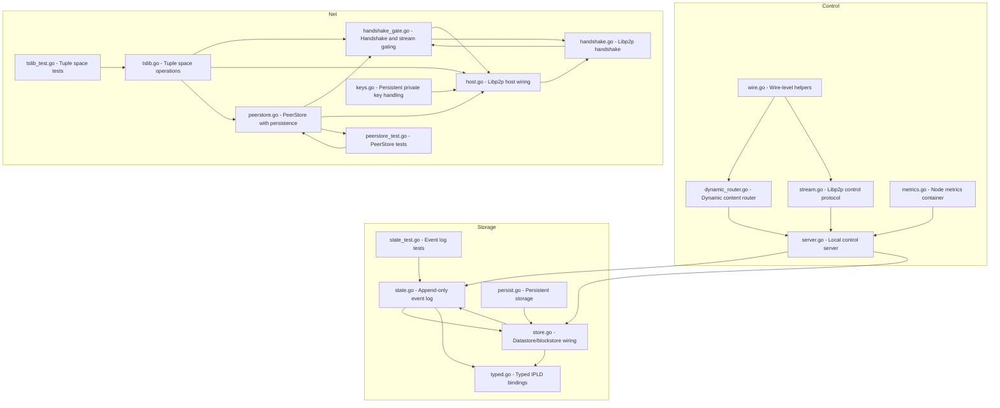

    

    <b>Automatic Architecture Diagrams from Code</b> 
    <a href="https://github.com/swark-io/swark">GitHub</a> • <a href="https://swark.io">Website</a> • <a href="mailto:contact@swark.io">Contact Us</a>

## Usage Instructions

1. **Render the Diagram**: Use the links below to open it in Mermaid Live Editor, or install the [Mermaid Support](https://marketplace.visualstudio.com/items?itemName=bierner.markdown-mermaid) extension.
2. **Recommended Model**: If available for you, use `claude-3.5-sonnet` [language model](vscode://settings/swark.languageModel). It can process more files and generates better diagrams.
3. **Iterate for Best Results**: Language models are non-deterministic. Generate the diagram multiple times and choose the best result.

## Generated Content
**Model**: GPT-4o - [Change Model](vscode://settings/swark.languageModel)  
**Mermaid Live Editor**: [View](https://mermaid.live/view#pako:eNp9lE1v4jAQhv-KlXPZlfbIYSUgtFDCV6m0h6RCJpkmEY5t2Q4rVPW_7yROmqFIm5Of8TvDzDshH0GqMgjGQSJzw3XBXsNEMnxsffKBmZLOKOGjzTOJ_5YGfuSKjdgfPI0EXECwAoQGY98G4TTOrpJXZXo0qnZgfEroYyzFuiAd83ckbRZbZ4BXXh6VJ_1Lt2rsgmmjnEqVIPowrsCZMrU-YYPzsC7SpvFS3tSfxxbMpW8nUikXX-X9TScGmSXymxsHpwzPYaj2iN1y19kx0RqTRkqKK0NTcDqhcvLTT158dGCdz5j3KtbEqHuLuLGz7IU7D43a-h6Idhk3sa6JkDve4s-TUOm5PTJcWSlpK8-xu2rIfMprc2TLXRSyUykzVNr_eLABN9RZxQWXmS34GY75lxGLPsbwwPw-GV7f9hDFhern6_bcBO6bXcfOivLUNVtrAcxqngJT6BFWVZI6t0Hn0K3BkR3iobPBFUz3VqbUw-0wyG1HfZRod_EZrvZuMdqUF7SA4WWbJm6n2A99kTdgaO77G_DipyZaOjpVky1N2Gj0m00pzDxMW5h7mFEIKcxbeKSw9PB4D88enmjOgsqW9GZJc1YtRBS2HiIK6xZWFCIKGw8bKttQmYe9hy2V7ahsT6u9tLBOZPAQVGAqXmb4ifxIAldABUkwZkmQwTuvhUuCTxTVOsPFhyXHf0gVjJ2p4SHgtVOHq0x7xi9dXgTjdy4sfP4DY1ajbA) | [Edit](https://mermaid.live/edit#pako:eNp9lE1v4jAQhv-KlXPZlfbIYSUgtFDCV6m0h6RCJpkmEY5t2Q4rVPW_7yROmqFIm5Of8TvDzDshH0GqMgjGQSJzw3XBXsNEMnxsffKBmZLOKOGjzTOJ_5YGfuSKjdgfPI0EXECwAoQGY98G4TTOrpJXZXo0qnZgfEroYyzFuiAd83ckbRZbZ4BXXh6VJ_1Lt2rsgmmjnEqVIPowrsCZMrU-YYPzsC7SpvFS3tSfxxbMpW8nUikXX-X9TScGmSXymxsHpwzPYaj2iN1y19kx0RqTRkqKK0NTcDqhcvLTT158dGCdz5j3KtbEqHuLuLGz7IU7D43a-h6Idhk3sa6JkDve4s-TUOm5PTJcWSlpK8-xu2rIfMprc2TLXRSyUykzVNr_eLABN9RZxQWXmS34GY75lxGLPsbwwPw-GV7f9hDFhern6_bcBO6bXcfOivLUNVtrAcxqngJT6BFWVZI6t0Hn0K3BkR3iobPBFUz3VqbUw-0wyG1HfZRod_EZrvZuMdqUF7SA4WWbJm6n2A99kTdgaO77G_DipyZaOjpVky1N2Gj0m00pzDxMW5h7mFEIKcxbeKSw9PB4D88enmjOgsqW9GZJc1YtRBS2HiIK6xZWFCIKGw8bKttQmYe9hy2V7ahsT6u9tLBOZPAQVGAqXmb4ifxIAldABUkwZkmQwTuvhUuCTxTVOsPFhyXHf0gVjJ2p4SHgtVOHq0x7xi9dXgTjdy4sfP4DY1ajbA)

